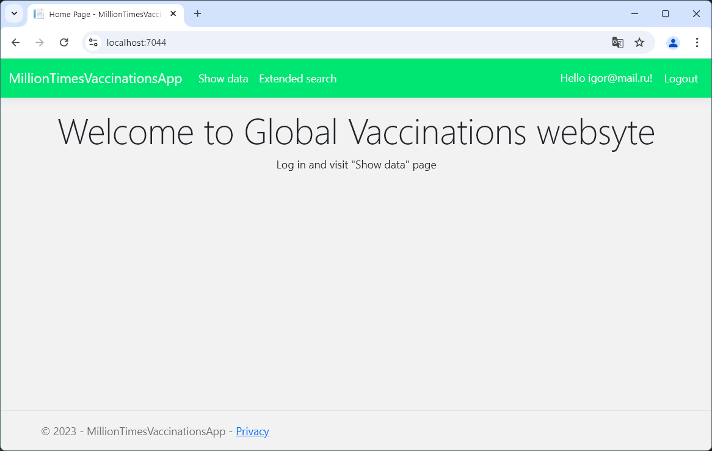
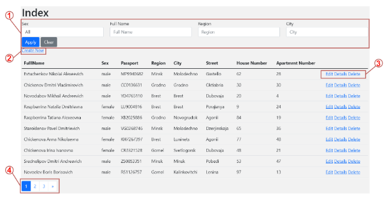

# Global Vaccinations Application
An application designed to record vaccination data and classify this data

### Features description
The developed web application implements the following functionality:
  1. Viewing, adding, changing and deleting vaccines and information about them;
  2. Viewing, adding, changing and deleting vaccinations and information about them;
  3. Viewing, adding, changing and deleting doses and information about them;
  4. Viewing, adding, changing and deleting dosages for vaccines and information about them;
  5. Viewing, adding, changing and deleting patients and information about them;
  6. Viewing, adding, changing and deleting medical institutions and information about them;
  7. Viewing, adding, changing and deleting diseases and information about them;
  8. Viewing, adding, changing and deleting messages after vaccination and information about them;
  9. Viewing vaccination information for a given patient;
  10. Viewing the number of vaccinations for a given region (city) against a given disease;
  11. Viewing the number of vaccination messages in a given year, broken down by month.
  
Each of the pages for displaying information has fields for filtering data by several criteria and a breakdown of data by pages at the bottom of the page.
In addition, two roles were developed for accessing the system: *administrator* and *user*.

### Application home page

### Displaying data

Let's look at each of the highlighted controls in the figure:
  1. Data filtering panel. Used to search for patients by specified criteria.
  2. Button for adding a new patient. Available only to administrators.
  3. Panel for working with a record. Contains three buttons: show detailed information, edit record, delete record. The functions for editing and deleting records are available only to the administrator.
  4. Panel for navigating through pages. Allows you to navigate between pages with records about patients.
